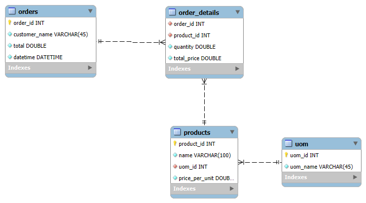

# grocery-store-management-system

## Database Schema



## Setting up
### Create conda env
```
conda create --name myenv python=3.8
```

### Activate conda env
```
conda activate myenv
```

### install depedencies
```
pip install -r requirements.txt
```

### setup env variables
create ```.env``` file in your root directory and insert the following details;
```
DB_USER="username<like root>"
DB_PASSWORD="your_password"
DB_HOST="host <like 127.0.0.1>"
DB_NAME="database_name"
```